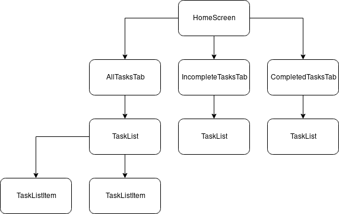

Todo apps have always been a good first app for starters to learn something new. I also created this app solely for learning purposes. I have used `provider` package which is now the [recommended way](https://www.youtube.com/watch?v=d_m5csmrf7I) of managing your state inside [Flutter](https://flutter.dev) apps. So, I will be showing you how you can create a Todo app yourself with flutter using `provider` as the state management system.

You can find the finished app [here](https://github.com/shakib609/todos-flutter).

### Prerequisites

- Basic Understanding of Flutter and Dart
- Flutter must be installed properly on your system

### Creating and Installing dependencies

We will start by creating a flutter app. You can use your favorite IDE([Android Studio](https://developer.android.com/studio), [Intellij IDEA](https://www.jetbrains.com/idea/), [VS Code](https://code.visualstudio.com/)) to create your flutter app. But, I will be creating the app through the terminal. You can run the command below from your workspace to create a new `flutter` project.

```shell
$ flutter create todos
```

After creating the app. Go to your project directory and open up the `pubspec.yaml` file. And add the dependency for the `provider` package we will be using for managing the state of our app. You can remove the `cupertino-icons` dependency from the file. We will not be using anything from that package in this project.

```yaml
dependencies:
  flutter:
    sdk: flutter
  provider: ^2.0.1+1
```

After updating the file run the below command to fetch all the packages enlisted in your `pubspec.yaml` file.

```shell
$ flutter packages get
```

The above command will create a new directory named `todos` in your workspace. We can now start working on our todos app.

### Creating Model

We will be working with a single model on our app. As this is a very simple app we only need to create a **Task**'s `title` and whether it's `completed` or not.

I like to keep my projects organized. So, I have created this model in a separate file inside the `lib/models` directory. My `lib/models/task.dart` file looks like this. I have assumed that when a `completed` argument is not passed to the constructor the `Task` is not complete.

**P.S.** I imported the `material` package here to annotate the required arguments to the `Todo` class constructor. Also, here

```dart
import 'package:flutter/material.dart';

class Task {
  String title;
  bool completed;

  Task({@required this.title, this.completed = false});

  void toggleCompleted() {
    completed = !completed;
  }
}
```

### Creating `TodosModel` Provider

This is the section where I created the `TodosModel` class which extends the `ChangeNotifier` class. This is a `provider` package specific class. This model will help us change the state of our app and also notify flutter when to re-render our app or app portions. So, let's create a new file `lib/providers/todos_model.dart`.

Here, I am using the `UnmodifiableListView` from `dart:collection` to create my getters. This is to ensure that our getters can not be manipulated in any way from outside of the `TodosModel` declaration.

One other important thing you might notice is that the frequent use of `notifyListeners`. This method notifies flutter whether the state change requires a re-render of UI or not.

**P.S.** Only the UI widget which are listening to the provider will be re-rendered.

```dart
import 'dart:collection';

import 'package:flutter/material.dart';

import 'package:todos/models/task.dart';

class TodosModel extends ChangeNotifier {
  final List<Task> _tasks = [];

  UnmodifiableListView<Task> get allTasks => UnmodifiableListView(_tasks);
  UnmodifiableListView<Task> get incompleteTasks =>
      UnmodifiableListView(_tasks.where((todo) => !todo.completed));
  UnmodifiableListView<Task> get completedTasks =>
      UnmodifiableListView(_tasks.where((todo) => todo.completed));

  void addTodo(Task task) {
    _tasks.add(task);
    notifyListeners();
  }

  void toggleTodo(Task task) {
    final taskIndex = _tasks.indexOf(task);
    _tasks[taskIndex].toggleCompleted();
    notifyListeners();
  }

  void deleteTodo(Task task) {
    _tasks.remove(task);
    notifyListeners();
  }
}
```

### Finally UI

In this final section, I will discuss on how I laid out the UI and also how I plugged the `TodosModel` I created in the previous section.

First let's see the structure of the app.

The app will mainly consist of two screens.

- Home Screen
- Add Task Screen

Again Home Screen will have a TabView containing these tabs

- All Tasks
- Incomplete Tasks
- Complete Tasks

Let's look at the widget tree of the `HomeScreen` widget we have to create to make our app.



All three tabs will show similar widgets. Only filtering according to the selected tab.

Let's start out writing our `TaskListItem` widget. We will use a `ListTile` widget to create this widget. The `TaskListItem` class will be instantiated with a `Task` instance which will be later processed and rendered to the UI. I created a new file in this location for this widget: `lib/widgets/task_list_item.dart`.

Another new thing to notice here is the use of `Provider.of<TodosModel>(context, listen: false)` inside the `onChanged` and `onPressed` arguments. The `provider` package relies heavily on the static type system of Dart. Here `Provider.of<TodosModel>(context, listen: false)` reveals the instance of `TodosModel` instance we will later supply to our app. This instance can then be used to call any methods on that class. The `listen: false` argument tells flutter that this widget does not need to be re-rendered on state changes.

```dart
import 'package:flutter/material.dart';
import 'package:provider/provider.dart';

import 'package:todos/models/task.dart';
import 'package:todos/providers/todos_model.dart';

class TaskListItem extends StatelessWidget {
  final Task task;

  TaskListItem({@required this.task});

  @override
  Widget build(BuildContext context) {
    return ListTile(
      leading: Checkbox(
        value: task.completed,
        onChanged: (bool checked) {
          Provider.of<TodosModel>(context, listen: false).toggleTodo(task);
        },
      ),
      title: Text(task.title),
      trailing: IconButton(
        icon: Icon(
          Icons.delete,
          color: Colors.red,
        ),
        onPressed: () {
          Provider.of<TodosModel>(context, listen: false).deleteTodo(task);
        },
      ),
    );
  }
}

```

Now, We will create the `TaskList` widget which will employ the previously created `TaskListItem` widget to show a list of tasks inside a `ListView` widget. For now, I am not providing any placeholder `Text` or anything to indicate an empty list but you are welcome to go ahead and insert a new widget here to tell the user that the current `TaskList` widget is empty.

```dart
import 'package:flutter/material.dart';

import 'package:todos/models/task.dart';
import 'package:todos/widgets/task_list_item.dart';

class TaskList extends StatelessWidget {
  final List<Task> tasks;

  TaskList({@required this.tasks});

  @override
  Widget build(BuildContext context) {
    return ListView(
      children: getChildrenTasks(),
    );
  }

  List<Widget> getChildrenTasks() {
    return tasks.map((todo) => TaskListItem(task: todo)).toList();
  }
}
```

We are now ready to create all the necessary tabs for our `HomeScreen` widget. We will keep the tabs of our `HomeScreen` widget in a separate directory. Let's start by creating our `AllTasksTab` widget first. (`lib/tabs/all_tasks.dart`)

```dart
import 'package:flutter/material.dart';
import 'package:provider/provider.dart';

import 'package:todos/providers/todos_model.dart';
import 'package:todos/widgets/task_list.dart';

class AllTasksTab extends StatelessWidget {
  @override
  Widget build(BuildContext context) {
    return Container(
      child: Consumer<TodosModel>(
        builder: (context, todos, child) => TaskList(
              tasks: todos.allTasks,
            ),
      ),
    );
  }
}
```

`Consumer` is a new widget provided by the `provider` package. This widget provides an easy way to listen for changes in the provider state and re-render accordingly. It is generally considered a bad practice to enclose a huge widget tree inside a `Consumer` widget. This widget should be inserted as deep as possible in the widget tree to prevent unnecessary re-renders. For more info, see [here](https://flutter.dev/docs/development/data-and-backend/state-mgmt/simple#consumer).

We need to re-render all the list items in case any of the task item changes. That's why I have enclosed the use of `TaskList` widget inside the `Consumer`. Now whenever our provider calls `notifyListener` in its model. It will re-render our `TaskList` widget.

Similarly, try creating the remaining two tab widgets before continuing. I am giving my code below just in case.

```dart
// lib/tabs/completed_tasks.dart
import 'package:flutter/material.dart';
import 'package:provider/provider.dart';

import 'package:todos/providers/todos_model.dart';
import 'package:todos/widgets/task_list.dart';

class CompletedTasksTab extends StatelessWidget {
  @override
  Widget build(BuildContext context) {
    return Container(
      child: Consumer<TodosModel>(
        builder: (context, todos, child) => TaskList(
              tasks: todos.completedTasks,
            ),
      ),
    );
  }
}
```

```dart
// lib/tabs/incomplete_tasks.dart
import 'package:flutter/material.dart';
import 'package:provider/provider.dart';

import 'package:todos/providers/todos_model.dart';
import 'package:todos/widgets/task_list.dart';

class IncompleteTasksTab extends StatelessWidget {
  @override
  Widget build(BuildContext context) {
    return Container(
      child: Consumer<TodosModel>(
        builder: (context, todos, child) => TaskList(
              tasks: todos.incompleteTasks,
            ),
      ),
    );
  }
}
```

Now we can create our `HomeScreen` widget. This will be a fairly simple widget which will use the widgets we previously created for our app.

Let's look at the code:

```dart
import 'package:flutter/material.dart';

import 'package:todos/tabs/all_tasks.dart';
import 'package:todos/tabs/completed_tasks.dart';
import 'package:todos/tabs/incomplete_tasks.dart';

class HomeScreen extends StatefulWidget {
  @override
  _HomeScreenState createState() => _HomeScreenState();
}

class _HomeScreenState extends State<HomeScreen>
    with SingleTickerProviderStateMixin {
  TabController controller;

  @override
  void initState() {
    super.initState();
    controller = TabController(length: 3, vsync: this);
  }

  @override
  Widget build(BuildContext context) {
    return Scaffold(
      appBar: AppBar(
        title: Text('Todos'),
        actions: <Widget>[
          IconButton(
            icon: Icon(Icons.add),
            onPressed: () {
            },
          ),
        ],
        bottom: TabBar(
          controller: controller,
          tabs: <Widget>[
            Tab(text: 'All'),
            Tab(text: 'Incomplete'),
            Tab(text: 'Complete'),
          ],
        ),
      ),
      body: TabBarView(
        controller: controller,
        children: <Widget>[
          AllTasksTab(),
          IncompleteTasksTab(),
          CompletedTasksTab(),
        ],
      ),
    );
  }
}
```

The app should display all, completed and incomplete tasks correctly now and you should be able to toggle the state of a task's `completed` property. But we cannot test our app yet. We need some demo tasks to check if our app is working. Let's add some.

Open your `provider/todos_model.dart` file and add some instances of `Task` model to the `_tasks` property.

```dart
  final List<Todo> _todos = [
    Todo(title: 'Finish the app'),
    Todo(title: 'Write a blog post'),
    Todo(title: 'Share with community'),
  ];
```

Now give your app a go. All the tasks we created are incomplete. Try toggling them by tapping the checkbox. Our app should be working fine now. You should be able to Update, Delete the tasks we created through the UI. Now, the last thing we need to do is create a screen for adding Tasks to our app. We will create a simple `AddTaskScreen` stateful widget to provide this functionality to our users. We are using a stateful widget because we need the value of the `TextField` and the `Checkbox` widget from this widget while creating new tasks.

```dart
import 'package:flutter/material.dart';
import 'package:provider/provider.dart';

import 'package:todos/providers/todos_model.dart';
import 'package:todos/models/task.dart';

class AddTaskScreen extends StatefulWidget {
  @override
  _AddTaskScreenState createState() => _AddTaskScreenState();
}

class _AddTaskScreenState extends State<AddTaskScreen> {
  final taskTitleController = TextEditingController();
  bool completedStatus = false;

  @override
  void dispose() {
    taskTitleController.dispose();
    super.dispose();
  }

  void onAdd() {
    final String textVal = taskTitleController.text;
    final bool completed = completedStatus;
    if (textVal.isNotEmpty) {
      final Task todo = Task(
        title: textVal,
        completed: completed,
      );
      Provider.of<TodosModel>(context, listen: false).addTodo(todo);
      Navigator.pop(context);
    }
  }

  @override
  Widget build(BuildContext context) {
    return Scaffold(
      appBar: AppBar(
        title: Text('Add Task'),
      ),
      body: ListView(
        children: <Widget>[
          Padding(
            padding: EdgeInsets.all(15.0),
            child: Container(
              child: Column(
                crossAxisAlignment: CrossAxisAlignment.stretch,
                children: <Widget>[
                  TextField(controller: taskTitleController),
                  CheckboxListTile(
                    value: completedStatus,
                    onChanged: (checked) => setState(() {
                          completedStatus = checked;
                        }),
                    title: Text('Complete?'),
                  ),
                  RaisedButton(
                    child: Text('Add'),
                    onPressed: onAdd,
                  ),
                ],
              ),
            ),
          )
        ],
      ),
    );
  }
}
```

We again used the `Provider.of<TodosModel>(context, listen: false)` from the `provider` package to call the `addTodo` method on the `TodosModel`. This makes sure our app state changes and all the listening widgets are notified of this change and are re-rendered.

Now, all we need to do is hook up this screen with our `HomeScreen` widget and Voila! Let's do that. Open up your `lib/screens/home_screen.dart` file and update the `IconButton` widgets `onPressed` argument to include this.

```dart
import 'package:flutter/material.dart';

import 'package:todos/screens/add_task_screen.dart';

...
...


            onPressed: () {
              Navigator.push(
                context,
                MaterialPageRoute(
                  builder: (context) => AddTaskScreen(),
                ),
              );
            },

...
...
```

This will take the user to the `AddTaskScreen` whenever the **+** button is pressed on the `Appbar`. Now, all we need to do is wrap our main app in `lib/main.dart` inside a `ChangeNotifierProvider` widget which will pass our `TodosModel` instance to all the widgets inside our app. Update your `lib/main.dart` file like below:

```dart
import 'package:flutter/material.dart';
import 'package:provider/provider.dart';

import 'package:todos/screens/home_screen.dart';
import 'package:todos/providers/todos_model.dart';

void main() => runApp(TodosApp());

class TodosApp extends StatelessWidget {
  @override
  Widget build(BuildContext context) {
    return ChangeNotifierProvider(
      builder: (context) => TodosModel(),
      child: MaterialApp(
        title: 'Todos',
        theme: ThemeData.dark(),
        home: HomeScreen(),
      ),
    );
  }
}

```

Now, our app is ready. Congratulations on creating your first Todo app using Flutter using Provider.

Thanks for reading the post. I am providing some more resources from where you can learn more about the usage of `provider` package with `flutter`.

- [Github repo of the `provider` package](https://github.com/rrousselGit/provider)
- [Simple State Management - Official Flutter Docs](https://flutter.dev/docs/development/data-and-backend/state-mgmt/simple)
- [Understand the Provider/BLoC Pattern in 5 Minutes: Developer School](https://developer.school/posts/flutter-provider-and-bloc-in-5-minutes/)
