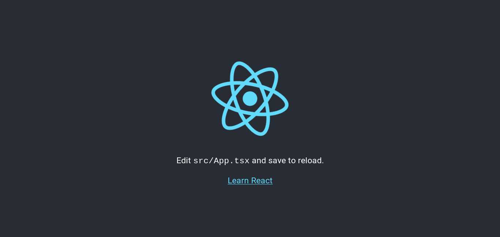

Nowadays, in most cases we see that there's a backend that provides an API and various front-end technologies like [React](https://reactjs.org), [Vue](https://vuejs.org), Mobile apps use this API endpoints to provide a user interface to the user. This method of development is becoming more and more popular with the rise in popularity of the great JavaScript frameworks like [React](https://reactjs.org), [Vue](https://vuejs.org), [Angular](https://angular.io/) etc.

There are mainly two ways you can deploy this kind of web apps:

- **Separating Backend and Frontend:** In this method, you server your back-end and front-end apps separately and they connect to each other with their respective URIs. One major overead of this approach is you have to configure `CORS` yourself. If you don't know about `CORS` you can learn more [here](https://en.wikipedia.org/wiki/Cross-origin_resource_sharing).
- **Serving from the same host:** In this method you will be serving the app from the same URI so it removes the `CORS` overhead. Also, it makes it easier to maintain smaller-medium sized apps. You don't want to create two separate repositories for some simple sites like a blog, to-do etc.

# Overview

I will show you how I integrated my **Django** app with my **React.js** front-end. We will follow the below steps:

- Generate a React app with `create-react-app`
- Create virtualenv and install necessary dependencies
- Generate a django project inside our React app
- Update both app settings
- Deploy to Heroku

The code example shown in this tutorial is available [here](https://github.com/shakib609/django-react-boilerplate).

# Setup

I am listing the tech stack I am using below, just in case:

- Node 11.15.0
- Python 3.7.3
- yarn 1.17.3 (Node package manager)
- poetry 0.12.16 (Python package manager)

P.S. [**poetry**](https://poetry.eustace.io) is fairly new to the Python community. This makes the dependency management of python projects much more convenient. Also, similar to `pipenv` this handles the virtualenv for you. You can use this one or just use `pip`, `pipenv` or any other solution you like.

# Generating React App

First, We have to generate our react application which will work as our front-end. For this tutorial, I'll name the project `django-react-boilerplate`. Change it to your liking. Let's create our react app. Here, I am generating a react app that uses **TypeScript**. You can ignore that by just ommitting the `--typescript` part from the above command. Run the below command to generate your React app:

```shell
$ yarn create react-app django-react-boilerplate --typescript
```

The above command will create a directory named `django-react-boilerplate` and it should have the below structure.

```
django-react-boilerplate
├── node_modules
├── public
│   ├── index.html
│   ├── favicon.ico
│   └── manifest.json
├── src
│   ├── App.css
│   ├── App.test.tsx
│   ├── App.tsx
│   ├── index.css
│   ├── index.tsx
│   ├── logo.svg
│   ├── react-app-env.d.ts
│   └── serviceWorker.ts
├── package.json
├── tsconfig.json
└── yarn.lock
```

# Create Python Virtualenv

I will use **Poetry** to do this. So, if you are following exactly step-by-step you have to install poetry. You can get instructions from [here](https://poetry.eustace.io/docs/#installation). You are free to choose any other virtual environment solution you like in your case. First of all let's change directory to the generated react app. And then initialize poetry. It will ask you some general project related questions. You can choose to answer them, otherwise default values from Poetry will be used. You can also install your dependencies when you are installing your app but I will not do that in my case. After following the above instructions your shell might look something like this.

```shell
$ cd django-react-boilerplate
$ poetry init

This command will guide you through creating your pyproject.toml config.

Package name [django-react-boilerplate]:
Version [0.1.0]:
Description []:
Author [Shakib Hossain <shakib609@gmail.com>, n to skip]:
License []:
Compatible Python versions [^3.7]:

Would you like to define your dependencies (require) interactively? (yes/no) [yes] no


Would you like to define your dev dependencies (require-dev) interactively (yes/no) [yes] no

Generated file

[tool.poetry]
...
...

Do you confirm generation? (yes/no) [yes] yes
```

After finishing up generating your `pyproject.toml` file. You can now move on to installing the dependencies which we will need for our project. Let's install them:

```shell
$ poetry add django djangorestframework whitenoise gunicorn django-heroku
```

The above command will generate a virtualenv for you and install all the dependencies into it.

P.S. You might face problems while installing `django-heroku` if you don't have `postgresql` installed.

# Generate Django App

Now it's time to generate our `django` app. We have to first enable our virtualenv. If you're using `poetry` then follow along, otherwise use your solutions method of activating the virtualenv. **Poetry** users can activate their virtualenv using the below command:

```shell
$ poetry shell
```

After activating the shell now we have access to our `django` python package and scripts that come with that package like `django-admin`. Let's generate our project inside the `django-react-boilerplate` directory. I am naming my backend project name `backend`. You're free to choose your own. Run the below command to generate the project inside the current directory:

```shell
# Make sure you're inside the django-react-boilerplate directory
$ django-admin startproject backend .
```

After generating the django project our project structure will look something similar to this.

```shell
├── backend
│   ├── __init__.py
│   ├── settings.py
│   ├── urls.py
│   └── wsgi.py
├── manage.py
├── package.json
├── Procfile
├── public
│   ├── index.html
│   ├── favicon.ico
│   └── manifest.json
├── pyproject.toml
├── README.md
├── src
│   ├── App.css
│   ├── App.test.tsx
│   ├── App.tsx
│   ├── index.css
│   ├── index.tsx
│   ├── logo.svg
│   ├── react-app-env.d.ts
│   └── serviceWorker.ts
├── tsconfig.json
└── yarn.lock
```

# Update Settings

First change that we will do is add a `proxy` key to our `package.json`. This will proxy all our API requests in development. You can learn more about it [here](https://facebook.github.io/create-react-app/docs/proxying-api-requests-in-development). Add the following line to your `package.json` file.

```json
{
  ...
  "proxy": "http://localhost:8000"
}
```

After that, we have to create a directory named `static` inside the `public` directory. We will move the contents of the `public` directory into this new `static` directory except the `index.html` file. After moving the `public` directory should look like this.

```
public
├── index.html
└── static
    ├── favicon.ico
    └── manifest.json
```

We have to move these files, so that when we build our React app by executing `yarn build` we will get these files inside a `build/static` directory, which we will use as our Django projects `STATIC_ROOT`.

Now, according our directory structure we have to refactor the `public/index.html` file. Open `public/index.html` file and update the `favicon.ico` and `manifest.json` urls to `/static/favicon.ico` and `/static/manifest.json`.

All the configuration to our React app is done. Now, we have to configure our Django project.

We mainly have one HTML file to serve(the React app generated HTML file). Let's create a view in our django app to serve this HTML file. I'll use Generic TemplateView to create the view. Create a `views.py` file inside the `backend` directory and add the below python code to the file:

```python
from django.views.generic import TemplateView
from django.views.decorators.cache import never_cache

# Serve Single Page Application
index = never_cache(TemplateView.as_view(template_name='index.html'))
```

One thing to notice here that, I am using the `never_cache` decorator while initializing the `index` view. This decorator is pretty straight-forward. This adds headers to a response so that it will never be cached. We will be generating our `index.html` file from our React app which might change any time. That's why we do not want any browser to cache obsolete `index.html` file.

We've wrote the `index` view. Now let's add it to the `urls.py`. We will serve the `index.html` from our root url. Now open your `urls.py` and update it according to the code below:

```python
from django.contrib import admin
from django.urls import path

from .views import index

urlpatterns = [
    path('', index, name='index'),
    path('admin/', admin.site.urls),
]
```

Most of our work is done. All now we have to do is update our `backend/settings.py` file. Here, we'll first do everything as instructed in `django-heroku` [documentation](https://devcenter.heroku.com/articles/django-app-configuration#settings-py-changes). After applying these changes, Our app won't work straightaway. We have to update our `settings.py` file further to make it work. First, add `whitenoise` and `rest_framework` to your `INSTALLED_APPS` like below. You have to list `whitenoise` right before `django.contrib.staticfiles`. And we also have to add the `whitenoise` middleware right after Djangos `SecurityMiddleware`.

```python
INSTALLED_APPS= [
    ...
    'whitenoise.runserver_nostatic',  # < As per whitenoise documentation
    'django.contrib.staticfiles',

    # 3rd party apps
    'rest_framework',
]

MIDDLEWARE = [
    'django.middleware.security.SecurityMiddleware',
    'whitenoise.middleware.WhiteNoiseMiddleware',  # Whitenoise Middleware
    ...
]
```

Now, we have to update our `TEMPLATES` settings, so that our django app can find the `index.html` we referred to in our `backend/views.py` file. You can add additional directories you want to include here too.

```python
TEMPLATES = [
    {
        'BACKEND':
        'django.template.backends.django.DjangoTemplates',
        'DIRS':
        [os.path.join(BASE_DIR, 'build')]
        ...
    }
]
```

Almost ready! We have to update our `STATIC` file related settings and move them to the bottom of the `backend/settings.py` file. Update your `settings.py` file like below:

```python
# Configure app for Heroku deployment
django_heroku.settings(locals())

# Static files (CSS, JavaScript, Images)
# https://docs.djangoproject.com/en/2.1/howto/static-files/
STATIC_URL = '/static/'
# Place static in the same location as webpack build files
STATIC_ROOT = os.path.join(BASE_DIR, 'build', 'static')
STATICFILES_DIRS = []

# If you want to serve user uploaded files add these settings
MEDIA_URL = '/media/'
MEDIA_ROOT = os.path.join(BASE_DIR, 'build', 'media')

STATICFILES_STORAGE = 'whitenoise.storage.CompressedManifestStaticFilesStorage'
```

# Testing Our Setup

We are now ready to test our app. A few things we have to keep in mind in this setup:

- Always run `yarn build` after you've updated your front-end
- While developing, you have to run the `react` server and `django` server separately to make use of the built-in hot-reload of these servers.

Now, run the below commands to test whether our app is serving the files correctly.

```shell
$ yarn build
$ poetry shell
$ python manage.py runserver
```

Open your preffered browser and navigate to `localhost:8000`. You should see the default React app.

.

# Preparing for Heroku Deployment

First, let's create our `heroku` app with the below command(Make sure you have `heroku-cli` installed):

```shell
$ heroku create drt-boilerplate
```

Add `nodejs` and `python` buildpacks and the `postgresql` addon to our app.

```shell
$ heroku buildpacks:add --index 1 heroku/nodejs
$ heroku buildpacks:add --index 2 heroku/python
$ heroku addons:create heroku-postgresql:hobby-dev
```

Create a `Procfile`:

```Procfile
release: python manage.py migrate
web: gunicorn backend.wsgi --log-file -
```

Here, the `release` option makes sure to run your django migrations after each deploy. And the `web` option serves your django application using `gunicorn` HTTP server.

You have to generate a `requirements.txt` file for `heroku` deployments. So, don't forget to do that.

```shell
$ poetry run pip freeze > requirements.txt
```

We are ready to push the first version of our app. Create a git repository and make a commit. After that, push the files to heroku by running the below command:

```shell
$ git push heroku master
```

This will trigger a deploy and show you your deploy progress. After a successful deploy it will show you the URL of your app. In my case, the URL is [https://drt-boilerplate.herokuapp.com/](https://drt-boilerplate.herokuapp.com/). Now, pat yourself on the back for accomplishing this. 😀
